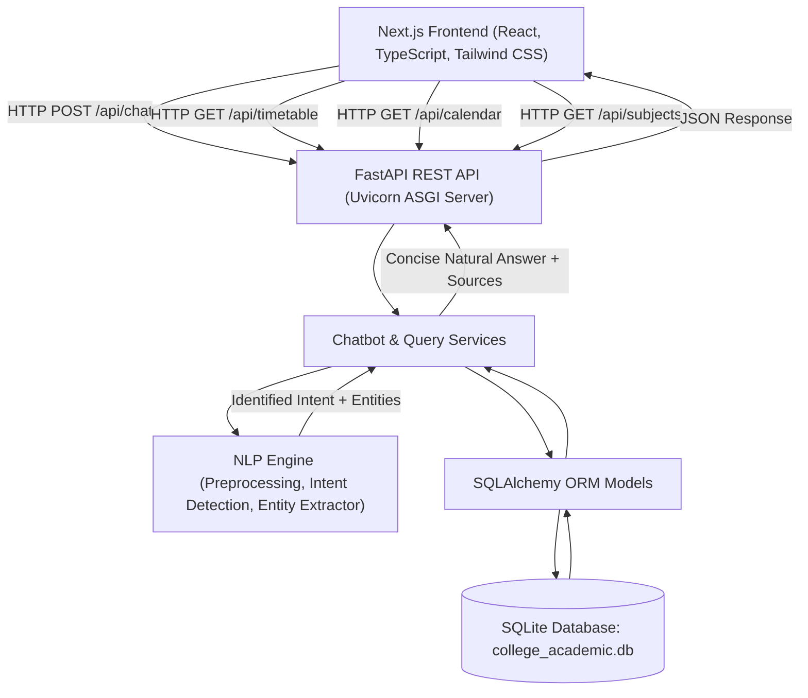

# MCA Academic Assistant Chatbot Using Natural Language Processing

An intelligent, full-stack college FAQ and academic assistant chatbot engineered for students of the **Department of Computer Applications (MCA), PSG College of Arts & Science**, focusing on the **Time Table & Academic Calendar (2026–2027)** domain.

---

## 1. Project Title
**MCA Academic Assistant Chatbot Using Natural Language Processing**

---

## 2. Problem Statement
College students frequently struggle to quickly locate up-to-date schedule information across disconnected documents, notices, and handbook PDFs. Inquiries regarding class periods, laboratory venues, faculty assignments, Continuous Assessment (CA) test schedules, semester milestones, and examination fee deadlines are repetitive yet critical. A centralized, conversational assistant powered by NLP bridges this gap, allowing students to ask questions in plain English and receive instant, authoritative answers without misinformation or hallucination.

---

## 3. Objective
- Provide accurate, instant answers to student queries regarding the **MCA Semester III Timetable** and **PSGCAS Academic Calendar 2026–2027**.
- Eliminate hallucination by restricting responses strictly to the authoritative college database.
- Parse diverse natural-language query variations into structured intents and entities.
- Offer an interactive, modern web portal with weekly timetable grids, calendar filtering, and course curriculum details.

---

## 4. Key Features
- **Conversational NLP Chatbot**:
  - Natural question handling with intent classification and entity extraction.
  - Suggested question chips for instant one-click queries.
  - Real-time backend status indicator and auto-scrolling conversation area.
  - Strict truthful response guardrail: returns *"I couldn't find that information in the current academic timetable/calendar."* whenever data is absent.
  - Direct citations/source tagging for every response.
- **Interactive Weekly Timetable (`/timetable`)**:
  - Full Day I through Day VI coverage for MCA Semester III.
  - Highlights laboratories differently from theory lectures.
  - Displays room allocations (e.g., ML Lab in Room `E-311`, AI Lab in Room `E-208`).
  - Clear visual notice banners for **Morning Break (12:00 PM – 12:15 PM)** and **Lunch Break (1:15 PM – 2:00 PM)**.
  - Searchable and filterable by day order, subject, room, and faculty.
- **Searchable Academic Calendar 2026–2027 (`/calendar`)**:
  - Covers Odd Semester (June 2026 – October 2026) and Even Semester (December 2026 – April 2027).
  - Quick category filtering: Holidays, CA Tests, Comprehensive Examinations, Fee Payment Deadlines, Semester Dates, Academic Events.
  - Month-wise selector and live keyword search.
  - Summary metric cards showing total events, declared holidays, and test cycles.
  - Highlighting key semester milestones and monthly working-day totals.
- **Subject Curriculum & Faculty Information (`/subjects`)**:
  - Detailed breakdown of all Semester III courses (AI, ML, FSD, AM/SQA, TDC PG).
  - Course codes, syllabi summaries, faculty assignments, and scheduled theory/lab slots.
  - One-click navigation to chat directly about any course.

---

## 5. Tech Stack

### Frontend:
- **Framework**: Next.js 16 (App Router)
- **UI Library**: React 19
- **Language**: TypeScript
- **Styling**: Tailwind CSS v4
- **Icons**: Lucide React

### Backend:
- **Framework**: Python 3.13 / FastAPI
- **Server**: Uvicorn ASGI
- **Data Validation**: Pydantic v2
- **Testing**: Pytest & FastAPI TestClient

### Database:
- **Engine**: SQLite
- **ORM**: SQLAlchemy 2.0
- **Seeding**: Automated idempotent seed pipeline with authoritative data

---

## 6. System Architecture



---

## 7. Database Design

### 1. `timetable` Table
| Column | Type | Constraints | Description |
|---|---|---|---|
| `id` | Integer | Primary Key | Unique slot identifier |
| `day_order` | String(20) | Indexed, Not Null | Day order (`Day I` to `Day VI`) |
| `start_time` | String(20) | Not Null | Period start time (e.g. `10:00 AM`) |
| `end_time` | String(20) | Not Null | Period end time (e.g. `11:00 AM`) |
| `subject` | String(100) | Not Null | Subject or session name |
| `room` | String(50) | Nullable | Classroom or lab venue (e.g. `E-311`, `E-208`) |
| `faculty` | String(200) | Nullable | Assigned faculty members |
| `class_type` | String(50) | Not Null | `Theory`, `Lab`, `Break`, `Lunch` |
| `subject_id` | Integer | Foreign Key | References `subjects.id` |

### 2. `subjects` Table
| Column | Type | Constraints | Description |
|---|---|---|---|
| `id` | Integer | Primary Key | Unique subject identifier |
| `code` | String(50) | Unique, Indexed | Course code (e.g. `25CAP314`, `25CAP321`) |
| `name` | String(150) | Not Null | Full course name |
| `description` | Text | Nullable | Syllabus description |
| `class_type` | String(50) | Not Null | `Theory`, `Lab`, `Major Elective` |
| `faculty` | String(200) | Nullable | Faculty handling the subject |

### 3. `calendar_events` Table
| Column | Type | Constraints | Description |
|---|---|---|---|
| `id` | Integer | Primary Key | Unique event identifier |
| `date` | String(20) | Indexed, Not Null | Date format `YYYY-MM-DD` |
| `day` | String(20) | Not Null | Day of week (`Monday`, `Tuesday`, etc.) |
| `event` | String(250) | Not Null | Event name |
| `category` | String(100) | Indexed, Not Null | `Holiday`, `CA Test`, `Examination`, `Fee Payment`, `Semester Date`, `Academic Event` |
| `semester` | String(50) | Nullable | `Odd Semester`, `Even Semester` |
| `is_holiday` | Boolean | Default False | Whether the day is a declared public holiday |
| `description` | Text | Nullable | Detailed notes regarding the event |

---

## 8. NLP Approach

The chatbot avoids brittle exact keyword matching by utilizing an NLP processing pipeline:
1. **Preprocessing & Token Normalization**:
   - Lowercases, collapses whitespace, preserves slashes (`AM/SQA`) and room numbers (`E-311`, `E-208`).
2. **Entity Extraction**:
   - **`day_order`**: Normalizes `Day 1`, `Day I`, `first day`, `third day`, `Day 3`, `on III` to `Day I` .. `Day VI`.
   - **`subject`**: Resolves aliases (e.g. `ai` -> `AI`, `artificial intelligence lab` -> `AI Lab`, `fsd` -> `FSD`, `sqa` / `agile` -> `AM/SQA`, `tdc` -> `TDC (PG)`).
   - **`room`**: Detects room numbers such as `E-311` and `E-208`.
   - **`time` / `time_of_day`**: Parses `11 AM`, `2:00 PM`, `morning`, `afternoon`.
   - **`semester`**: Parses `odd`, `even`, `semester 3`.
   - **`date` & `month`**: Parses explicit dates (e.g., `22 December`, `August`, `15 June`).
   - **`ca_test`**: Extracts `I CA`, `II CA`.
3. **Intent Detection**:
   Classifies into standard semantic intents:
   - `timetable_query`, `day_schedule`, `time_schedule`, `next_class`, `today_schedule`, `tomorrow_schedule`
   - `subject_schedule`, `subject_days_query`, `room_query`, `lab_query`, `faculty_query`, `break_query`
   - `semester_start`, `semester_end`, `ca_test_query`, `exam_query`, `fee_deadline_query`, `holiday_query`, `event_query`, `working_days_query`, `general_help`
4. **Authoritative Database Query Execution**:
   - SQLAlchemy retrieves verified records.
5. **Concise Response Formulation & Hallucination Guardrail**:
   - Formulates clear, student-friendly responses.
   - If the requested item does not exist, safely replies:
     `"I couldn't find that information in the current academic timetable/calendar."`

---

## 9. API Documentation

| Method | Endpoint | Description |
|---|---|---|
| `GET` | `/api/health` | Service health status check |
| `POST` | `/api/chat` | Main conversational NLP chatbot endpoint |
| `GET` | `/api/timetable` | Retrieves complete MCA Semester III timetable |
| `GET` | `/api/timetable/day/{day_order}` | Retrieves scheduled periods for a specific day |
| `GET` | `/api/timetable/subject/{subject}` | Retrieves schedule slots for a subject |
| `GET` | `/api/calendar` | Retrieves calendar events with category/semester filters |
| `GET` | `/api/calendar/date/{date}` | Retrieves events on a specific date |
| `GET` | `/api/calendar/month/{month}` | Retrieves events in a specific month |
| `GET` | `/api/calendar/holidays` | Retrieves declared college holidays |
| `GET` | `/api/calendar/working-days` | Retrieves monthly working day totals |
| `GET` | `/api/subjects` | Retrieves all courses with faculty and schedules |

### Example Chat Request & Response:
**Request:**
```json
POST /api/chat
Content-Type: application/json

{
  "message": "When is my AI class on Day III?"
}
```

**Response:**
```json
{
  "answer": "AI is scheduled on Day III from 3:00 PM to 5:00 PM.",
  "intent": "subject_schedule",
  "sources": [
    "MCA Semester III Timetable"
  ]
}
```

---

## 10. Project Structure

```
AI_project2/
├── backend/
│   ├── app/
│   │   ├── __init__.py
│   │   ├── main.py                     # FastAPI app initialization, CORS, lifespan
│   │   ├── database.py                 # SQLAlchemy SQLite engine & session
│   │   ├── models.py                   # ORM models (Timetable, Subject, CalendarEvent)
│   │   ├── schemas.py                  # Pydantic v2 validation schemas
│   │   ├── routes/
│   │   │   ├── chat.py                 # POST /api/chat route
│   │   │   ├── timetable.py            # /api/timetable routes
│   │   │   ├── calendar.py             # /api/calendar routes
│   │   │   └── subjects.py             # /api/subjects routes
│   │   ├── services/
│   │   │   ├── chatbot.py              # Chatbot coordinator & response logic
│   │   │   ├── nlp.py                  # NLP entity extractor & intent classifier
│   │   │   ├── timetable_service.py    # Timetable query helpers
│   │   │   └── calendar_service.py     # Calendar query helpers
│   │   └── seed/
│   │       └── seed_database.py        # Authoritative database seeding script
│   ├── tests/
│   │   └── test_backend.py             # Pytest test suite (20 tests)
│   ├── requirements.txt
│   ├── .env.example
│   └── college_academic.db
│
├── frontend/
│   ├── app/
│   │   ├── layout.tsx                  # Root layout, fonts, Navbar, Footer
│   │   ├── page.tsx                    # Main Chatbot interface
│   │   ├── globals.css                 # Tailwind CSS styles
│   │   ├── timetable/
│   │   │   └── page.tsx                # Weekly Timetable page
│   │   ├── calendar/
│   │   │   └── page.tsx                # Academic Calendar page
│   │   └── subjects/
│   │       └── page.tsx                # Subjects & Syllabus page
│   ├── components/
│   │   └── Navbar.tsx                  # Responsive Navigation Bar with live health badge
│   ├── lib/
│   │   └── api.ts                      # Client-side API fetch methods
│   ├── types/
│   │   └── index.ts                    # TypeScript type definitions
│   └── package.json
│
├── README.md
└── .gitignore
```

---

## 11. Installation Instructions

### Prerequisites
- Python 3.10+ (tested on Python 3.13)
- Node.js 18+ (tested on Node v24.12)
- npm 9+ (tested on npm 11.6)

---

## 12. How to Run the Backend (Windows)

1. Open PowerShell and navigate to the `backend` folder:
   ```powershell
   cd backend
   ```

2. (Optional) Create and activate a Python virtual environment:
   ```powershell
   python -m venv venv
   .\venv\Scripts\activate
   ```

3. Install required Python packages:
   ```powershell
   pip install -r requirements.txt
   ```

4. Seed the database with authoritative data (automatic on first run, or run manually):
   ```powershell
   python -m app.seed.seed_database
   ```

5. Start the FastAPI development server:
   ```powershell
   python -m uvicorn app.main:app --reload --port 8000
   ```
   The backend API will be available at: `http://127.0.0.1:8000`  
   Interactive API docs (Swagger): `http://127.0.0.1:8000/docs`

---

## 13. How to Run the Frontend (Windows)

1. Open a second PowerShell terminal and navigate to the `frontend` folder:
   ```powershell
   cd frontend
   ```

2. Install dependencies:
   ```powershell
   npm install
   ```

3. Start the Next.js development server:
   ```powershell
   npm run dev
   ```

4. Open your browser and navigate to:  
   `http://localhost:3000`

---

## 14. Example Chatbot Questions

Students can ask queries such as:

| Category | Example Question | Expected Answer Summary |
|---|---|---|
| **Timetable** | "What do I have on Day I?" | Lists Day I periods (TDC, AI, ML, FSD, AM/SQA) |
| **Time Schedule** | "What is my class at 11 AM on Day I?" | AI (11:00 AM - 12:00 PM) |
| **Day Part** | "What do I have on Day III afternoon?" | AM/SQA (2:00 PM - 3:00 PM) and AI (3:00 PM - 5:00 PM) |
| **Lab Location** | "Where is ML Lab?" | Room E-311 |
| **Lab Timing** | "When is FSD Lab?" | Day III (11:00 AM - 12:15 PM) & Day IV (2:00 PM - 5:00 PM) |
| **Room Lookup** | "What room is AI Lab in?" | Room E-208 |
| **Day Schedule** | "What is my schedule on Day V?" | FSD, ML, AI, FSD, AM/SQA |
| **Semester Start** | "When does the odd semester start?" | Classes commence on 15 June 2026 |
| **Semester Start** | "When does the even semester start?" | Classes commence on 2 December 2026 |
| **Semester End** | "When is the last working day of the odd semester?" | 23 October 2026 |
| **Semester End** | "When is the last working day of the even semester?" | 16 April 2026 / 16 April 2027 |
| **CA Tests** | "When are the II CA Tests?" | 28 Sep - 3 Oct 2026 (Odd Sem) & 23 - 28 Mar 2026 (Even Sem) |
| **Holidays** | "What are the holidays in August?" | Independence Day (15 Aug) & Krishna Jayanthi (26 Aug) |
| **Holiday** | "When is Christmas holiday?" | 25 December 2026 |
| **Fee Deadline** | "When is the examination fee payment deadline?" | Without fine: 2 March 2026; With fine: 12 March 2026 |
| **Academic Event** | "What is the academic event on 22 December?" | National Mathematics Day (Srinivasa Ramanujan Birthday) |
| **Breaks** | "What is the lunch break?" | 1:15 PM - 2:00 PM |
| **Interval** | "What is the break time?" | 12:00 PM - 12:15 PM |
| **Faculty** | "Who handles AM/SQA?" | Dr. L. Thara, Dr. M. Mohanapriya & Dr. R.K |
| **Subject Days** | "Which days have AI?" | Day I, Day III, Day IV, Day V, and Day VI (Lab) |
| **Lab Overview** | "Which subjects have labs?" | AI Lab (E-208), ML Lab (E-311), FSD Lab (E-208), TDC Lab (E-311) |
| **Unknown Query** | "Tell me something that isn't in the database." | "I couldn't find that information in the current academic timetable/calendar." |

---

## 15. Testing

The backend includes a comprehensive automated test suite with **20 unit and integration tests** validating timetable lookup, day schedules, room venues, calendar events, holidays, semester dates, CA tests, intent detection, and non-hallucination guardrails.

To execute the tests:
```powershell
cd backend
python -m pytest tests/test_backend.py -v
```

All 20 tests pass with code 0:
```
tests/test_backend.py::test_health_check PASSED                          [  5%]
tests/test_backend.py::test_timetable_retrieval PASSED                   [ 10%]
tests/test_backend.py::test_day_schedule PASSED                          [ 15%]
tests/test_backend.py::test_subject_retrieval PASSED                     [ 20%]
tests/test_backend.py::test_calendar_retrieval PASSED                    [ 25%]
tests/test_backend.py::test_holiday_lookup PASSED                        [ 30%]
tests/test_backend.py::test_chat_room_lookup PASSED                      [ 35%]
tests/test_backend.py::test_chat_day_schedule PASSED                     [ 40%]
tests/test_backend.py::test_chat_subject_schedule PASSED                 [ 45%]
tests/test_backend.py::test_chat_semester_dates PASSED                   [ 50%]
tests/test_backend.py::test_chat_ca_tests PASSED                         [ 55%]
tests/test_backend.py::test_chat_christmas_holiday PASSED                [ 60%]
tests/test_backend.py::test_chat_lunch_time PASSED                       [ 65%]
tests/test_backend.py::test_chat_faculty PASSED                          [ 70%]
tests/test_backend.py::test_chat_august_holidays PASSED                  [ 75%]
tests/test_backend.py::test_chat_december_22_event PASSED                [ 80%]
tests/test_backend.py::test_chat_fee_deadline PASSED                     [ 85%]
tests/test_backend.py::test_chat_which_days_have_ai PASSED               [ 90%]
tests/test_backend.py::test_chat_which_subjects_have_labs PASSED         [ 95%]
tests/test_backend.py::test_chat_unknown_question PASSED                 [100%]
======================== 20 passed in 1.95s ========================
```

---

## 16. Future Improvements
- **Voice Input / Speech Recognition**: Integrate Web Speech API for voice-activated student queries.
- **Personalized Attendance & Exam Seating**: Allow individual student login to show seat numbers and attendance percentages.
- **Push Notifications / WhatsApp Webhooks**: Send automated reminders on fee payment deadline days and morning period notifications.
- **RAG / Vector Database Enhancement**: Support document attachments and syllabus queries via embeddings and semantic search.
